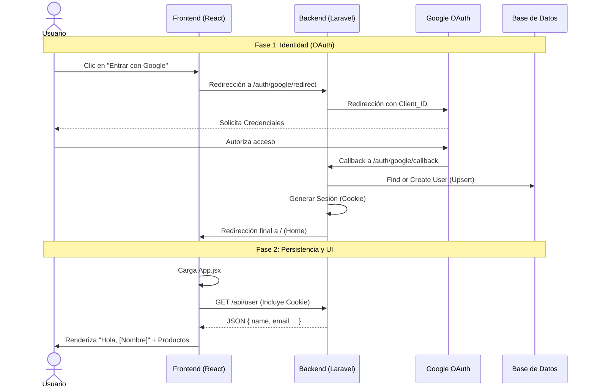

# 🛒 AICOR Shop - Full Stack E-commerce

Plataforma de comercio electrónico Full Stack implementada con arquitectura desacoplada (Headless). 
El proyecto integra una API RESTful robusta en Laravel con una interfaz de usuario reactiva moderna en React.

## 🚀 Stack Tecnológico

### Backend (API)
* **Framework:** Laravel 11
* **Lenguaje:** PHP 8.3
* **Base de Datos:** MariaDB 11.4
* **Autenticación:** Laravel Socialite (Google OAuth) + Laravel Sanctum (Session/Cookies).
* **API:** RESTful JSON.
* **Seguridad:** Transacciones DB (ACID) para pedidos, Configuración CORS/CSRF estricta.

### Frontend (SPA)
* **Framework:** React 18
* **Estado Global:** React Context API (Gestión de Carrito y UI).
* **Persistencia:** LocalStorage (Sincronización de carrito).
* **Build Tool:** Vite.
* **Estilos:** Tailwind CSS v3.4.
* **HTTP Client:** Axios (Configurado con `withCredentials = true`).

### Infraestructura (DevSecOps)
* **Contenerización:** Docker & Laravel Sail.
* **Arquitectura:** Soporte nativo para ARM64 (Apple Silicon) y AMD64.

---

## 🛠️ Guía de Despliegue (Entorno Local)

Sigue estos pasos para inicializar el entorno de desarrollo desde cero.

### 1. Inicializar Servicios Backend

El proyecto utiliza Docker para garantizar la paridad de entornos.

```bash
cd backend

# Configuración de variables de entorno
cp .env.example .env

# Levantar contenedores
./vendor/bin/sail up -d

# Instalación de dependencias
./vendor/bin/sail composer install
./vendor/bin/sail artisan key:generate

# ⚡ BASE DE DATOS Y DATOS DE PRUEBA
# Crea las tablas y rellena el catálogo con productos iniciales
./vendor/bin/sail artisan migrate:fresh --seed
```

### 2. Inicializar Cliente Frontend

En una nueva terminal:

```bash
cd frontend

# Instalación de dependencias de Node
npm install

# Iniciar servidor de desarrollo
npm run dev
```

* **Frontend:** [http://localhost:5173](http://localhost:5173)
* **API Productos:** [http://localhost/api/products](http://localhost/api/products)

---

## 🏗️ Arquitectura del Carrito (Estado Global)

Se ha implementado una solución de gestión de estado centralizada mediante **React Context API** (`CartContext.jsx`) con persistencia local.

### Capacidades del Sistema:
* **Persistencia Híbrida:** El carrito se sincroniza con `LocalStorage` para sobrevivir a recargas de página o cierres de navegador.
* **Lógica de Negocio:** Manejo automático de cantidades duplicadas, eliminación de ítems y cálculo dinámico de subtotales.
* **UI Reactiva:** Sidebar lateral deslizante y contadores en tiempo real.

---

## 🗄️ Modelo de Datos (Base de Datos)

El sistema utiliza una base de datos relacional para gestionar la integridad de los pedidos.

```mermaid
erDiagram
    USER ||--o{ ORDER : "realiza"
    ORDER ||--|{ ORDER_ITEM : "contiene"
    PRODUCT ||--o{ ORDER_ITEM : "referenciado en"

    USER {
        bigint id PK
        string name
        string email
    }

    ORDER {
        bigint id PK
        bigint user_id FK
        decimal total
        string status "pending, paid, shipped"
        timestamp created_at
    }

    ORDER_ITEM {
        bigint id PK
        bigint order_id FK
        bigint product_id FK
        int quantity
        decimal price "Precio histórico congelado"
    }

    PRODUCT {
        bigint id PK
        string name
        decimal price
        int stock
    }
```



---

## 🔌 API Endpoints Documentados

| Método | Endpoint | Descripción | Acceso |
| :--- | :--- | :--- | :--- |
| `GET` | `/sanctum/csrf-cookie` | Inicializa la protección CSRF | 🌍 Público |
| `GET` | `/auth/google/redirect` | Inicia flujo OAuth con Google | 🌍 Público |
| `GET` | `/api/user` | Obtener perfil del usuario (JSON) | 🔐 Privado (Auth) |
| `GET` | `/api/products` | Catálogo completo de productos | 🌍 Público |
| `POST` | `/api/orders` | **Crear nuevo pedido** | 🔐 Privado |
| `GET` | `/logout` | Cierre de sesión y limpieza de cookies | 🔐 Privado |

---

## 🔐 Flujo de Autenticación (OAuth 2.0 + Perfil)



---

## 💡 Notas Técnicas Importantes

### Gestión de CORS y Cookies
Para permitir la comunicación fluida entre dominios cruzados:
* **CORS:** Habilitado `supports_credentials => true` en el backend.
* **Axios:** Configurado `withCredentials = true` para enviar cookies de sesión en cada petición.

### Estrategia de Logout (Hard Redirect)
Para garantizar la destrucción total de la sesión `HttpOnly`, se utiliza una redirección física (`window.location.href`) hacia el endpoint `/logout` de Laravel. Esto fuerza al navegador a limpiar las cookies de sesión y evita estados inconsistentes en el cliente (SPA).

### Seguridad en Pedidos (Transacciones)
El sistema **no confía** en los precios enviados por el frontend. Al procesar un pedido:
1. Se abre una transacción de base de datos.
2. Se busca el precio real actual del producto en la BBDD.
3. Se guarda ese precio histórico en `order_items` (para evitar discrepancias futuras).

---

## 📅 Hoja de Ruta del Proyecto

| Fase | Estado | Descripción |
| :--- | :---: | :--- |
| **1. Infraestructura & Auth** | ✅ | Docker, React, Laravel, Google Login, Logout Seguro. |
| **2. Catálogo de Productos** | ✅ | Modelos DB, Migraciones, Seeders, API REST. |
| **3. Carrito de Compra** | ✅ | Context API, LocalStorage, Sidebar UI. |
| **4. Gestión de Pedidos** | 🚧 | Base de datos creada y API lista. **En debugging (Error 401)**. |
| **5. Pasarela de Pagos** | ⏳ | Simulación de checkout y flujo de pedidos completo. |

---

## 🐛 Problemas Conocidos (WIP)
* **Error 401 en Checkout:** Actualmente existe un conflicto con la validación CSRF en la ruta POST `/api/orders` que impide finalizar la compra aunque el usuario esté logueado. Pendiente de revisión de configuración `SameSite` en cookies.

---
**Autor:** Ángel - Desarrollador Full Stack Junior