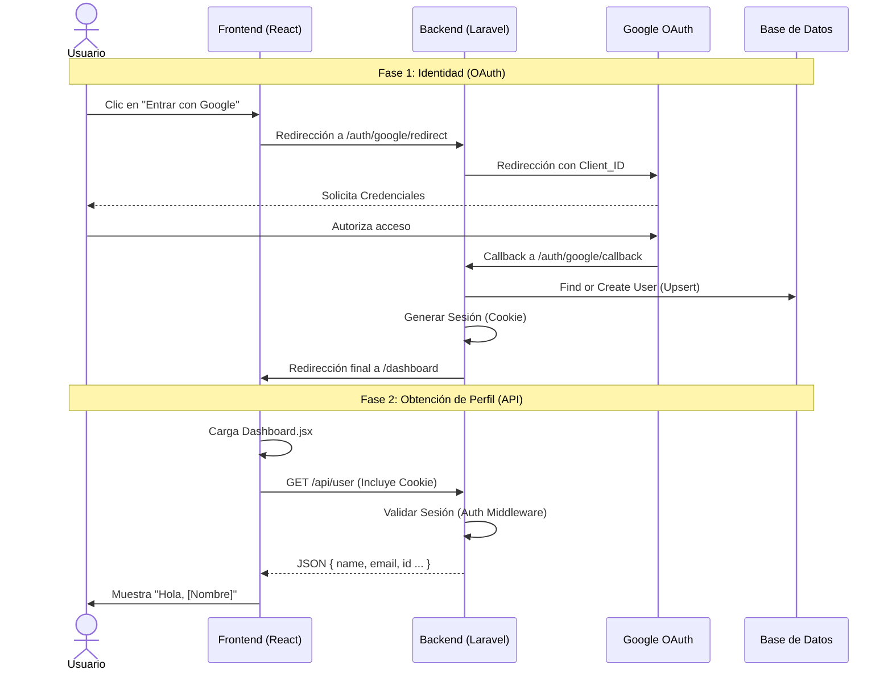

# 🛒 AICOR Shop - Full Stack E-commerce

Plataforma de comercio electrónico Full Stack implementada con arquitectura desacoplada (Headless). 
El proyecto integra una API RESTful robusta en Laravel con una interfaz de usuario reactiva moderna en React.

## 🚀 Stack Tecnológico

### Backend (API)
* **Framework:** Laravel 11
* **Lenguaje:** PHP 8.3
* **Base de Datos:** MariaDB 11.4
* **Autenticación:** Laravel Socialite (Google OAuth) + Laravel Sanctum (Session/Cookies).
* **API:** RESTful JSON.
* **Configuración:** CORS configurado para aceptar credenciales (`Access-Control-Allow-Credentials`).

### Frontend (SPA)
* **Framework:** React 18
* **Estado Global:** React Context API (Gestión de Carrito y UI).
* **Build Tool:** Vite.
* **Estilos:** Tailwind CSS v3.4.
* **Routing:** React Router DOM v6.
* **HTTP Client:** Axios (Configurado con `withCredentials = true`).

### Infraestructura (DevSecOps)
* **Contenerización:** Docker & Laravel Sail.
* **Arquitectura:** Soporte nativo para ARM64 (Apple Silicon) y AMD64.

---

## 🛠️ Guía de Despliegue (Entorno Local)

Sigue estos pasos para inicializar el entorno de desarrollo desde cero.

### 1. Inicializar Servicios Backend

El proyecto utiliza Docker para garantizar la paridad de entornos.

```bash
cd backend

# Configuración de variables de entorno
cp .env.example .env

# Levantar contenedores
./vendor/bin/sail up -d

# Instalación de dependencias
./vendor/bin/sail composer install
./vendor/bin/sail artisan key:generate

# ⚡ BASE DE DATOS Y DATOS DE PRUEBA
# Crea las tablas y rellena el catálogo con productos iniciales
./vendor/bin/sail artisan migrate:fresh --seed
```

### 2. Inicializar Cliente Frontend

En una nueva terminal:

```bash
cd frontend

# Instalación de dependencias de Node
npm install

# Iniciar servidor de desarrollo
npm run dev
```

* **Frontend:** [http://localhost:5173](http://localhost:5173)
* **API Productos:** [http://localhost/api/products](http://localhost/api/products)

---

## 🏗️ Arquitectura del Carrito (Estado Global)

Se ha implementado una solución de gestión de estado centralizada mediante **React Context API** (`CartContext.jsx`). 


### Capacidades del Sistema:
* **Persistencia en Sesión:** El carrito mantiene los productos mientras el usuario navega por la SPA.
* **Lógica de Negocio:** Manejo automático de cantidades duplicadas, eliminación de ítems y cálculo dinámico de subtotales.
* **Interfaz Reactiva:** Un componente `CartSidebar` que utiliza transiciones de Tailwind CSS para una experiencia fluida.

---

## 🔌 API Endpoints Documentados

| Método | Endpoint | Descripción | Acceso |
| :--- | :--- | :--- | :--- |
| `GET` | `/sanctum/csrf-cookie` | Inicializa la protección CSRF | 🌍 Público |
| `GET` | `/auth/google/redirect` | Inicia flujo OAuth con Google | 🌍 Público |
| `GET` | `/api/user` | Obtener perfil del usuario (JSON) | 🔐 Privado (Auth) |
| `GET` | `/api/products` | Catálogo completo de productos | 🌍 Público |

---

## 🔐 Flujo de Autenticación (OAuth 2.0 + Perfil)



---

## 💡 Notas Técnicas Importantes

### Gestión de CORS y Cookies
Para permitir la comunicación fluida entre dominios cruzados:
* **CORS:** Habilitado `supports_credentials => true` en el backend.
* **Axios:** Configurado `withCredentials = true` para enviar cookies de sesión en cada petición.

### Base de Datos y Modelos
* **Modelo Product:** Incluye asignación masiva (`$fillable`) para seguridad.
* **Seeders:** El sistema genera automáticamente datos realistas para pruebas de UI.

---

## 📅 Hoja de Ruta del Proyecto

| Fase | Estado | Descripción |
| :--- | :---: | :--- |
| **1. Infraestructura & Auth** | ✅ | Docker, React, Laravel, Google Login. |
| **2. Catálogo de Productos** | ✅ | Modelos DB, Migraciones, Seeders, API REST. |
| **3. Carrito de Compra** | ✅ | Gestión de estado (Context API), Sidebar UI. |
| **4. Pasarela de Pagos** | ⏳ | Simulación de checkout y flujo de pedidos. |

---
**Autor:** Ángel - Desarrollador Full Stack Junior