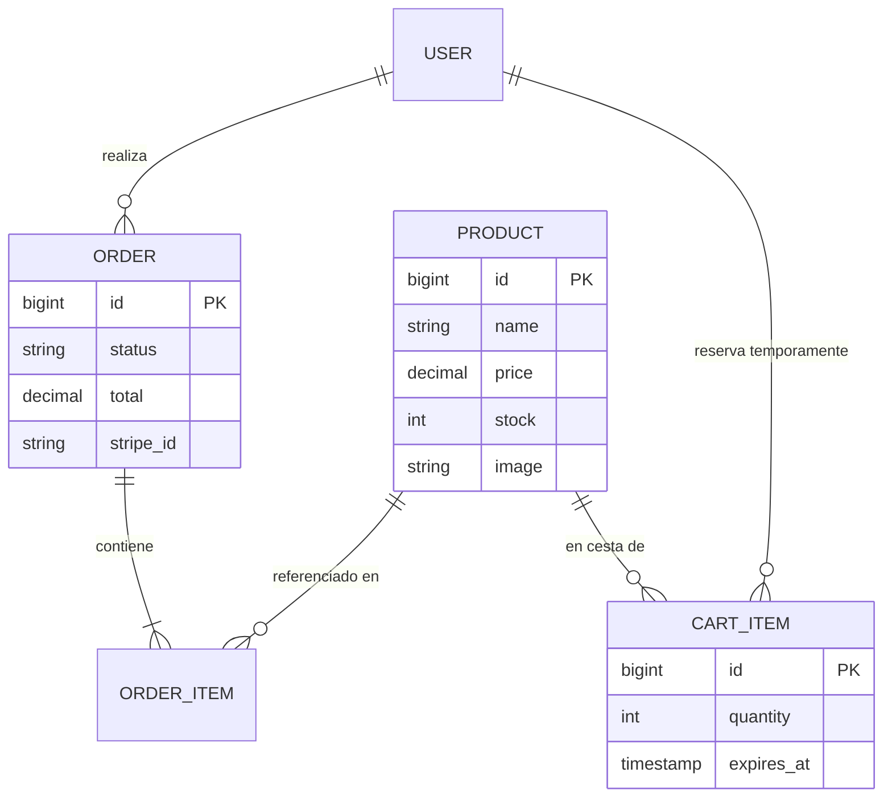

# 🛒 AICOR Shop - Full Stack E-commerce

Plataforma de comercio electrónico Full Stack implementada con arquitectura desacoplada (Headless). 
El proyecto integra una API RESTful robusta en Laravel con una interfaz de usuario reactiva moderna en React, destacando por su sistema de **Inventario Virtual**, reservas temporales y un panel administrativo integral.

## 🚀 Stack Tecnológico

### Backend (API)
* **Framework:** Laravel 12.5
* **Lenguaje:** PHP 8.3
* **Base de Datos:** MariaDB 11.4
* **Autenticación:** Laravel Socialite (Google OAuth Stateless) + Laravel Sanctum (Session/Cookies).
* **Seguridad & Lógica:** Transacciones DB (ACID) para pedidos, Control de concurrencia de Stock, Configuración CORS/CSRF estricta, Inventario Virtual (Reservas de 15 min).

### Frontend (SPA)
* **Framework:** React 18
* **Estado Global:** React Context API (Gestión de Carrito Sincronizado y persistencia de sesión).
* **Componentes:** Dashboard con sistema de pestañas (Pedidos/Inventario) y Modales reactivos.
* **Build Tool:** Vite.
* **Estilos:** Tailwind CSS v3.4 con animaciones personalizadas.
* **HTTP Client:** Axios (Configurado con `withCredentials` y `withXSRFToken`).

### Infraestructura (DevSecOps)
* **Contenerización:** Docker & Laravel Sail.
* **Arquitectura:** Soporte nativo para ARM64 (Apple Silicon) y AMD64.

---

## 🛠️ Guía de Despliegue (Entorno Local)

### 1. Inicializar Servicios Backend
```bash
cd backend
cp .env.example .env
# Configurar VITE_PORT=5174 y SANCTUM_STATEFUL_DOMAINS=localhost:5173
./vendor/bin/sail up -d
./vendor/bin/sail composer install
./vendor/bin/sail artisan key:generate
./vendor/bin/sail artisan migrate:fresh --seed
```

### 2. Inicializar Cliente Frontend
```bash
cd frontend
npm install
npm run dev
```

---

## 🏗️ Arquitectura del Sistema

### Gestión de Stock y Pedidos (Blindaje Técnico)
El sistema implementa una **Defensa en Profundidad** para evitar el *overselling*:
1. **Frontend (Sidebar/Cart):** Validación visual que bloquea el botón "+" si se alcanza el stock máximo disponible en la BBDD.
2. **Backend (Pre-pago):** Antes de generar el `PaymentIntent` de Stripe, se verifica de nuevo el almacén.
3. **Backend (Post-pago):** El `OrderController` ejecuta una **transacción ACID** que valida el stock y aplica un `decrement('stock')` atómico al confirmar la compra.

---

## 🗄️ Modelo de Datos (Base de Datos)



---

## 🔌 API Endpoints Documentados

| Método | Endpoint | Descripción | Acceso |
| :--- | :--- | :--- | :--- |
| **Catálogo & Admin** | | | |
| `GET` | `/api/products` | Lista completa de productos | 🌍 Público |
| `POST` | `/api/products` | **Crear nuevo producto** | 🔐 Admin |
| `PUT` | `/api/products/{id}` | **Editar stock/precio/info** | 🔐 Admin |
| `DELETE` | `/api/products/{id}` | Eliminar producto | 🔐 Admin |
| **Reservas (Carrito)** | | | |
| `GET` | `/api/cart` | Recuperar cesta guardada | 🔐 Privado |
| `POST` | `/api/cart` | Añadir / Incrementar cantidad | 🔐 Privado |
| `PUT` | `/api/cart/{id}` | **Actualizar cantidad (+/-)** | 🔐 Privado |
| `POST` | `/api/cart/clear` | Vaciar reservas | 🔐 Privado |
| **Pedidos** | | | |
| `GET` | `/api/orders` | Historial con detalles (Eager Loading) | 🔐 Admin |
| `POST` | `/api/orders` | Procesar compra y restar stock | 🔐 Privado |

---

## 💡 Notas Técnicas Críticas

### Idempotencia y React StrictMode
Se utiliza un `useRef` en la confirmación del pedido para evitar que el doble renderizado de desarrollo de React genere pedidos duplicados en la base de datos.

### Gestión de Datos Anidados
El carrito ha evolucionado a una estructura anidada (`item.product.price`) para mantener la integridad de la relación Eloquent. Esto permite que el Frontend siempre tenga acceso al stock actualizado en tiempo real del producto asociado a la línea del carrito.

### Dashboard CMS
El panel de administración utiliza un sistema de estados reactivos para alternar entre la gestión de **Pedidos** (vista financiera) e **Inventario** (gestión CRUD), permitiendo la actualización del catálogo sin necesidad de herramientas externas de base de datos.

---

## 📅 Hoja de Ruta del Proyecto

| Fase | Estado | Descripción |
| :--- | :--- | :--- |
| **1. Infraestructura & Auth** | ✅ | Docker, React, Laravel, Google Login Stateless. |
| **2. Catálogo de Productos** | ✅ | API REST y Seeders de prueba. |
| **3. Carrito de Compra** | ✅ | Reservas de 15 min, Botones +/- con validación de stock. |
| **4. Gestión de Pedidos** | ✅ | Transacciones DB y reducción de stock atómica. |
| **5. Pasarela de Pagos** | ✅ | Integración de Stripe (SCA Ready). |
| **6. Panel de Administración**| ✅ | Dashboard integral con CRUD de productos y detalle de pedidos. |

---
**Autor:** Ángel - Desarrollador Full Stack Junior