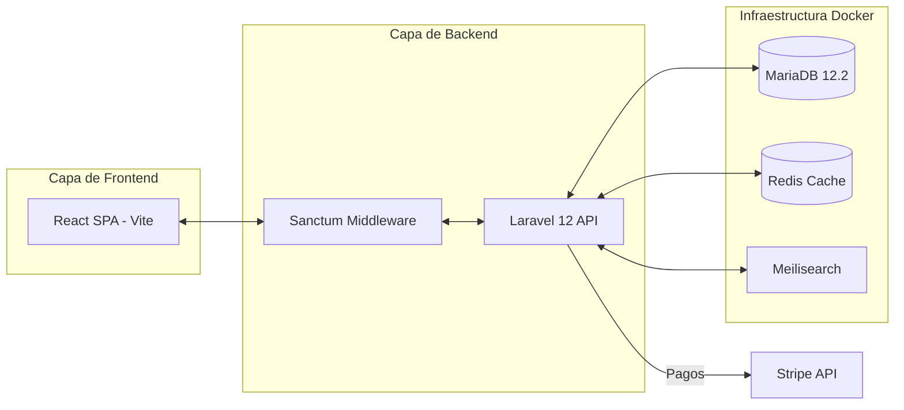

# 🛒 AICOR Shop - E-commerce Full Stack (Arquitectura Headless)


**AICOR Shop** es una plataforma de comercio electrónico de alto rendimiento desarrollada como **Proyecto de Fin de Grado (DAW)**. El sistema utiliza una **Arquitectura Headless**, desacoplando un backend robusto en **Laravel 12** de una interfaz ágil en **React 18**. El entorno actual está optimizado para su despliegue y evaluación en local mediante Docker, aunque su arquitectura sigue estándares preparados para entornos de producción.

---

## 🏗️ Arquitectura del Sistema

El sistema sigue un patrón desacoplado donde el frontend se comunica con el backend a través de una API RESTful segura.


```mermaid
graph LR
    subgraph Capa_Cliente [Capa de Frontend]
        SPA[React SPA - Vite]
    end

    subgraph Capa_API [Capa de Backend]
        Laravel[Laravel 12 API]
        Sanctum[Sanctum Middleware]
    end

    subgraph Capa_Infraestructura [Infraestructura Docker]
        MariaDB[(MariaDB 12.2)]
        Redis[(Redis Cache)]
        Meili[Meilisearch]
    end

    SPA <--> Sanctum
    Sanctum <--> Laravel
    Laravel <--> MariaDB
    Laravel <--> Redis
    Laravel <--> Meili
    Laravel -- Pagos --> Stripe[Stripe API]
```

### 🗄️ Modelo de Datos (Diagrama ER)

<details>
  <summary>Haz clic para expandir el Diagrama Entidad-Relación</summary>

  #### Descripción de Entidades y Atributos:
  - **USER** (Fondo lavanda):
    - `bigint id PK`
  - **PRODUCT** (Fondo lavanda):
    - `bigint id PK`
    - `string name`
    - `decimal price`
    - `int stock`
    - `string image`
  - **CART_ITEM** (Fondo lavanda):
    - `bigint id PK`
    - `int quantity`
    - `timestamp expires_at` (Campo crítico para Anti-Overselling)
  - **ORDER** (Fondo lavanda):
    - `bigint id PK`
    - `string status`
    - `decimal total`
    - `string stripe_id`
  - **ORDER_ITEM** (Fondo lavanda):
    - `bigint id PK`

  #### Representación Visual (Mermaid JS):

  ```mermaid
  erDiagram
      USER ||--o{ ORDER : realiza
      USER ||--o{ CART_ITEM : "reserva temporalmente"
      PRODUCT ||--o{ CART_ITEM : "en cesta de"
      PRODUCT ||--o{ ORDER_ITEM : "referenciado en"
      ORDER ||--o{ ORDER_ITEM : contiene

      USER {
          bigint id PK
      }

      PRODUCT {
          bigint id PK
          string name
          decimal price
          int stock
          string image
      }

      CART_ITEM {
          bigint id PK
          int quantity
          timestamp expires_at
      }

      ORDER {
          bigint id PK
          string status
          decimal total
          string stripe_id
      }

      ORDER_ITEM {
          bigint id PK
      }
  ```

  > [!NOTE]
  > *Esquema relacional estricto diseñado para garantizar la integridad de los datos y prevenir condiciones de carrera, totalmente coherente con la lógica de atomicidad de stock presentada.*
</details>

---

## 🚀 Stack Tecnológico (Versiones Verificadas)

Todo el entorno está orquestado mediante Docker, garantizando paridad total entre computadoras de desarrollo:

- **Framework de Backend:** Laravel 12.x
- **Entorno de Ejecución PHP:** v8.5 (FPM)
- **Base de Datos Relacional:** MariaDB v12.2
- **Caché y Almacenamiento NoSQL:** Redis (Alpine)
- **Motor de Búsqueda:** Meilisearch (Latest)
- **Entorno de Ejecución Frontend:** Node.js v20 (Alpine)
- **Framework de Frontend:** React 18 + Vite

---

## 🛡️ Seguridad y Gestión del Entorno (OWASP)

La seguridad es el pilar central del proyecto. La documentación y la gestión de secretos siguen las mejores prácticas de OWASP.

### ⚠️ Advertencia de Seguridad
> [!IMPORTANT]
> El archivo `.env` contiene secretos críticos como `STRIPE_SECRET`, `APP_KEY` y credenciales de acceso a datos. **NUNCA** debe ser incluido en el control de versiones.
> - Asegúrese de que el archivo `.env` permanezca en el `.gitignore`.
> - Evite exponer secretos críticos que puedan comprometer la integridad de los pagos o los datos del usuario.

### Conexión a la Base de Datos
Con la infraestructura activa, puede conectarse desde un cliente externo (ej. TablePlus, DBeaver) utilizando:
- **Host:** `127.0.0.1`
- **Puerto:** `3306` (o el valor definido en `FORWARD_DB_PORT`)
- **Credenciales:** Definidas de forma segura en su archivo `.env` local (generado a partir de `.env.example`).

---

## 🖥️ Infraestructura y Soporte ARM64

El proyecto está plenamente optimizado para arquitecturas **Apple Silicon (M1/M2/M3)**.

- **Arquitectura Nativa:** La configuración de `compose.yaml` utiliza explícitamente la plataforma `linux/arm64` para todos los servicios, eliminando la necesidad de emulación por Rosetta 2.
- **Rendimiento de E/S:** Se recomienda configurar Docker Desktop con **VirtioFS** para obtener el máximo rendimiento de lectura/escritura en macOS.

---

## 🛠️ Guía de Instalación

Siga estos pasos para configurar el entorno de desarrollo desde cero.

### 1. Preparación y Configuración del Backend
```bash
# Entrar al directorio del backend y copiar variables de entorno
cd backend && cp .env.example .env

# Configurar secretos (Stripe, Google API) en el archivo .env
# Levantar la infraestructura
./vendor/bin/sail up -d

# Inicializar claves de aplicación y base de datos
./vendor/bin/sail artisan key:generate
./vendor/bin/sail artisan migrate --seed
```

### 2. Configuración del Frontend
```bash
# Entrar al directorio del frontend e instalar dependencias
cd ../frontend && npm install

# Configurar el punto de acceso a la API en frontend/.env
echo "VITE_API_URL=http://localhost:8081" > .env

# Iniciar el servidor de desarrollo
npm run dev
```

---

## 📖 Diccionario de Variables de Entorno

| Variable | Alcance | Función |
| :--- | :--- | :--- |
| `STRIPE_SECRET` | Backend | Clave privada crítica para la creación de `PaymentIntents`. |
| `FRONTEND_URL` | Backend | URL de redirección tras flujos de autenticación. |
| `VITE_API_URL` | Frontend | Endpoint de la API (Por defecto: `http://localhost:8081`). |
| `SANCTUM_STATEFUL_DOMAINS` | Backend | Lista blanca para el intercambio de sesiones/CORS con la SPA. |

---

## 🧹 Mantenimiento y Resolución de Problemas

Si realiza cambios en el archivo `.env` y el sistema no los refleja, ejecute una limpieza profunda:

```bash
# Desde el directorio backend/
./vendor/bin/sail artisan optimize:clear
./vendor/bin/sail artisan config:clear
./vendor/bin/sail restart laravel.test frontend
```

---

## 🛡️ Auditoría de Calidad y Seguridad (DevSecOps)

- **Protección Front-End:** Consumo hermético de la API mediante instancias de Axios con `withCredentials: true` y validación estricta de tokens CSRF (`/sanctum/csrf-cookie`).
- **Atomicidad de Stock (Anti-Overselling):** El `OrderController` utiliza transacciones ACID (`DB::transaction`) para validar la disponibilidad en milisegundos y ejecutar un *Rollback* automático en caso de falta de inventario.
- **Quality Gate (CI/CD):** Pipeline automatizada en GitHub Actions. Cada *push* levanta un entorno efímero y ejecuta la suite de tests unitarios (TDD con PHPUnit) sobre una base de datos SQLite en memoria, bloqueando cualquier paso a producción que rompa la integridad.
- **Control de Acceso y Rate Limiting:** Endpoints administrativos blindados por `auth:sanctum` y middleware `ThrottleRequests` contra ataques de fuerza bruta.

---

## 🗺️ Roadmap y Proyección a Futuro

Al haber consolidado una arquitectura 100% API-First (Headless), el ecosistema está preparado para su escalabilidad horizontal. 
- [ ] **Fase 2:** Desarrollo de aplicación móvil nativa utilizando **React Native**, consumiendo los mismos endpoints de la API de Laravel sin necesidad de refactorizar la lógica de negocio.

---
**Desarrollador Responsable:** Ángel López | **Estado del Proyecto:** Listo para Evaluación - Estable
