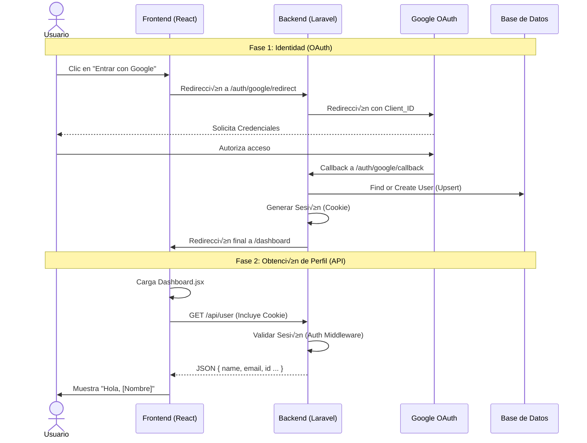

# üõí AICOR Shop - Full Stack E-commerce

Plataforma de comercio electrónico Full Stack implementada con arquitectura desacoplada (Headless).
El proyecto integra una API RESTful robusta en Laravel con una interfaz de usuario reactiva moderna.

## 🚀 Stack Tecnológico

### Backend (API)
* **Framework:** Laravel 11
* **Lenguaje:** PHP 8.3
* **Autenticación:** Laravel Socialite (Google OAuth) + Laravel Sanctum (Session/Cookies)
* **Base de Datos:** MariaDB 11.4
* **Configuración:** CORS configurado para aceptar credenciales en `localhost`.

### Frontend (SPA)
* **Framework:** React 18
* **Build Tool:** Vite
* **Estilos:** Tailwind CSS v3.4
* **Routing:** React Router DOM v6
* **HTTP Client:** Axios (Configurado globalmente con `withCredentials = true`).

### Infraestructura (DevSecOps)
* **Contenerización:** Docker & Laravel Sail
* **Arquitectura:** Soporte nativo para ARM64 (Apple Silicon) y AMD64.

---

## 🛠️ Guía de Despliegue (Entorno Local)

Sigue estos pasos para inicializar el entorno de desarrollo.

### 1. Inicializar Servicios Backend

El proyecto utiliza Docker para garantizar la paridad de entornos.

```bash
cd backend

# Configuración de variables de entorno
cp .env.example .env

# IMPORTANTE: Asegurar estas variables en .env para el Login
# SESSION_DOMAIN=localhost
# SANCTUM_STATEFUL_DOMAINS=localhost:5173

# Levantar contenedores
./vendor/bin/sail up -d

# Instalación de dependencias y migraciones
./vendor/bin/sail composer install
./vendor/bin/sail artisan config:publish cors # Publicar config de CORS
./vendor/bin/sail artisan key:generate
./vendor/bin/sail artisan migrate
```

### 2. Inicializar Cliente Frontend

En una nueva terminal:

```bash
cd frontend

# Instalación de dependencias de Node
npm install

# Iniciar servidor de desarrollo
npm run dev
```

Acceso a la aplicación: [http://localhost:5173](http://localhost:5173)

---

## 💡 Notas Técnicas Importantes

### Gestión de CORS y Cookies (Auth Loop Fix)
Para permitir la comunicación fluida entre `localhost:5173` (Frontend) y `localhost` (Backend):
* **CORS:** Se ha habilitado `supports_credentials => true` en `config/cors.php` y añadido el origen del frontend.
* **Axios:** Se ha configurado `axios.defaults.withCredentials = true` en el `main.jsx` de React.
* **Resultado:** La cookie de sesión (`laravel_session`) persiste en el navegador y se envía automáticamente en cada petición a la API (`/api/user`), permitiendo identificar al usuario tras el login de Google.

### Seguridad
* **Gestión de Secretos:** El archivo `.env` y las credenciales `client_secret*.json` están excluidos del control de versiones.
* **Sanitización:** El Frontend implementa limpieza de respuestas JSON para evitar errores de parseo en entornos de desarrollo (bug del carácter `<` en respuestas PHP).

---

## 🔐 Flujo de Autenticación Completo (OAuth 2.0 + Perfil)

El sistema implementa un flujo híbrido: OAuth para la identidad inicial y Cookies de Sesión para la persistencia.


```mermaid
sequenceDiagram
    actor User as Usuario
    participant FE as Frontend (React)
    participant BE as Backend (Laravel)
    participant Google as Google OAuth
    participant DB as Base de Datos

    Note over User, DB: Fase 1: Identidad (OAuth)
    User->>FE: Clic en "Entrar con Google"
    FE->>BE: Redirección a /auth/google/redirect
    BE->>Google: Redirección con Client_ID
    Google-->>User: Solicita Credenciales
    User->>Google: Autoriza acceso
    Google->>BE: Callback a /auth/google/callback
    BE->>DB: Find or Create User (Upsert)
    BE->>BE: Generar Sesión (Cookie)
    BE->>FE: Redirección final a /dashboard

    Note over User, DB: Fase 2: Obtención de Perfil (API)
    FE->>FE: Carga Dashboard.jsx
    FE->>BE: GET /api/user (Incluye Cookie)
    BE->>BE: Validar Sesión (Auth Middleware)
    BE-->>FE: JSON { name, email, id ... }
    FE->>User: Muestra "Hola, [Nombre]"
```

### Descripción del Ciclo
1.  **Login Social:** El usuario se autentica contra Google.
2.  **Persistencia:** Laravel crea una sesión segura asociada al email devuelto por Google.
3.  **Hidratación de Estado:** Al cargar el Dashboard, React consulta el endpoint `/api/user`. Gracias a la configuración de credenciales compartidas (CORS + Cookies), Laravel reconoce al usuario y devuelve sus datos privados para personalizar la interfaz.

---

## üìÖ Hoja de Ruta del Proyecto

| Fase | Estado | Descripción |
| :--- | :---: | :--- |
| **1. Infraestructura & Auth** | ‚úÖ | Docker, React, Laravel, Google Login, Dashboard Usuario. |
| **2. Catálogo de Productos** | ⏳ | Modelos DB, Migraciones, Seeders, Galería Frontend. |
| **3. Carrito de Compra** | ⬜ | Gestión de estado (Context API), Lógica de negocio. |
| **4. Pasarela de Pagos** | ⬜ | Simulación de checkout y pedidos. |

---
**Autor:** Ángel - Desarrollador Full Stack Junior